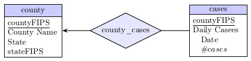

# COVID-Team-1
Covid analytics in python.

## Table of Contents
* [General Info](#General-info)
* [Technologies](#technologies)
* [Features](#features)
* [Sources](#sources)

## General Info
An end to end analytical model of covid 19 data gathered from the dataset at usafacts.org as well as other enrichment datasets. This model will help provide insight into the patterns and spread of Covid 19 in the United States.

## Technologies
Python 3.7.4

## Features

## Sources

## Diagrams

